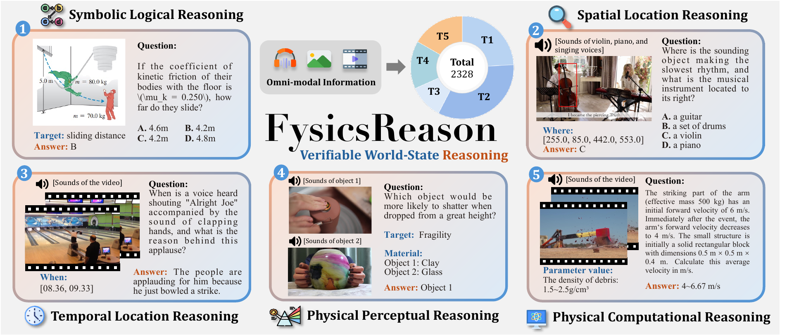
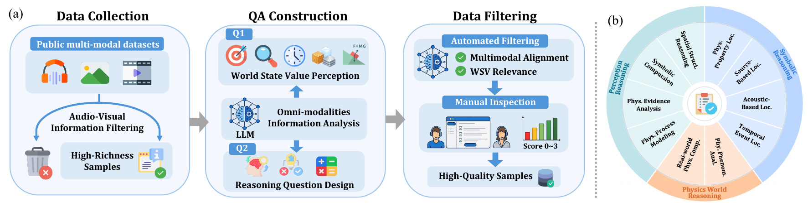
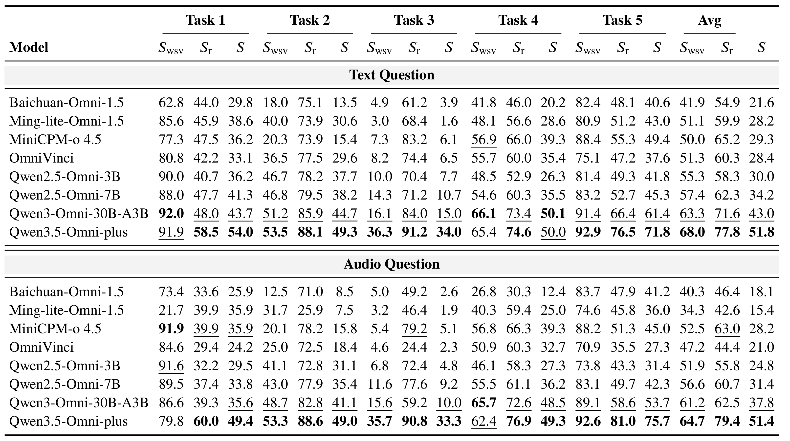

<div align="center">
<br>
<h1>FysicsReason: Benchmarking Verifiable World-State Reasoning Across Omni-Modalities</h1>

<h5 align="center"> If you like our project, please give us a star ⭐ on GitHub for the latest update.</h5>

<div align="center">
  <a href="https://github.com/Fysics-AI/FysicsReason">🏠 Project Page</a>
  &nbsp;&nbsp;
  <a href="PAPER_LINK">📖 Paper</a>
  &nbsp;&nbsp;
  <a href="https://huggingface.co/datasets/Fysics-AI/FysicsReason">🤗 Dataset</a>
  &nbsp;&nbsp;
  <a href="README_zh.md">中文版</a>
</div>


</div>

## 🚀 News
- **`2026-09-20`** We release **FysicsReason**, a benchmark for verifiable world-state reasoning across omni-modalities, with over 2,000 QA pairs and explicit intermediate world-state supervision.

## 🎯 ***FysicsReason*** Overview


We introduce ***FysicsReason***, a benchmark that evaluates omni-modal reasoning through a perception-then-reasoning paradigm with verifiable World State Variables (WSVs). The benchmark decomposes multimodal reasoning into explicit intermediate states and final outcomes, enabling finer-grained evaluation of both perception and reasoning.

***FysicsReason*** contains 2,000 QA pairs spanning image, audio, video, and text, and covers three capability families, five WSV types, and ten fine-grained capabilities across five WSV categories. It is designed to diagnose whether models can truly perceive the right evidence before reasoning to the final answer.

## 🔍 Data Construction


The dataset is built through data collection, QA construction, automated filtering, and manual inspection. Public multimodal sources are filtered for high-richness samples, then converted into WSV-aware reasoning questions with relevance and alignment checks.

## 📈 Experimental Results


We evaluate multiple models across text, audio, image, and video settings. The main table summarizes performance on the benchmark tasks and highlights the gap between intermediate world-state perception and final-answer correctness.

## 🧰 Evaluation

Prediction files should be JSONL, one sample per line:

```json
{"index":0,"task_source":"task1","wsv_answer":"...","final_answer":"..."}
```

`index` is the row index in `data/<task_source>/<task_source>.parquet`.
`task_source` is one of `task1`, `task2`, `task3`, `task4`, `task5`.
The same command can evaluate a single-task JSONL or a mixed all-task JSONL.

Run evaluation:

```bash
/share/apps/miniconda3/envs/download/bin/python \
  eval/judge.py \
  path/to/predictions.jsonl \
  --output path/to/judged.jsonl \
  --summary-output path/to/summary.json
```

For task2 bbox evaluation, choose the coordinate mode from the command line:

```bash
--task2-bbox-coordinate-mode auto
--task2-bbox-coordinate-mode absolute
--task2-bbox-coordinate-mode relative_1
--task2-bbox-coordinate-mode relative_1000
```

If a task2 `wsv_answer` bbox is relative instead of absolute pixel coordinates, provide the image size in that JSONL line:

```json
{"index":0,"task_source":"task2","wsv_answer":"[0.1,0.2,0.4,0.6]","final_answer":"A","image_width":1280,"image_height":720}
```

`image_width` and `image_height` are required for `relative_1` and `relative_1000`, and are also recommended for `auto` when relative coordinates may appear. They are not needed when `--task2-bbox-coordinate-mode absolute` is used with pixel-coordinate bboxes.

The output JSONL keeps the input fields and adds `S_wsv`, `S_r`, and `S`. The summary JSON reports these scores by task and as `Avg`.
